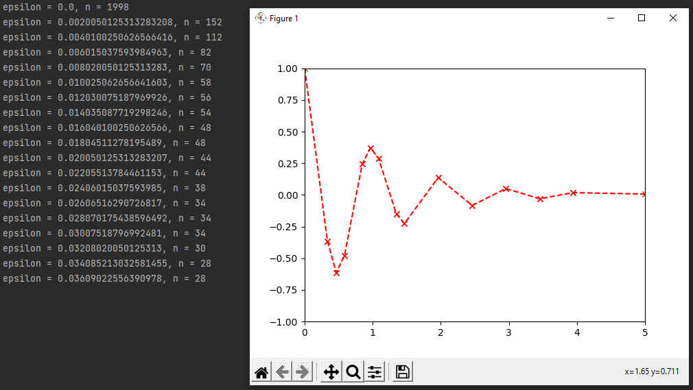

# RDP-Visualization
Visualization of the Ramer Douglas Peucker algorithm, an iterative end-point fit algorithm for decimating a polyline to a simpler polyline

The function used in the code (as shown in the above image) is  
<i><b>f(x)=e-xcos(2πx) for x in [0, 5]</b></i> as used in the wikipedia article <a href="https://en.wikipedia.org/wiki/Ramer%E2%80%93Douglas%E2%80%93Peucker_algorithm">RDP algorithm</a> 
The example function, variation of epsilon (inversely related to the fidelity of the approximated polyline), and the domain of x can be varied by the user  
Further, in the implemented program, code to plot the original polyline (in grey (solid)) (<i>not shown above</i>) along with the simplified polyline (in red (dashed)) has also been provided
